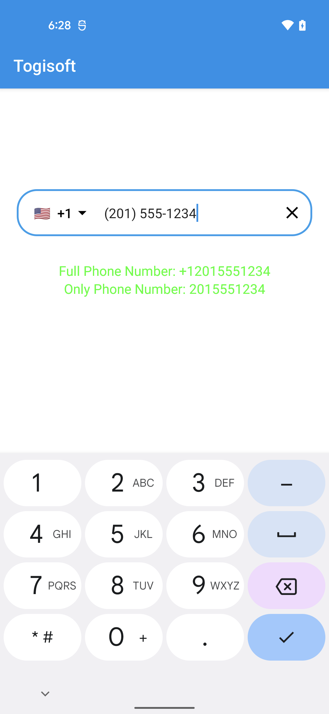
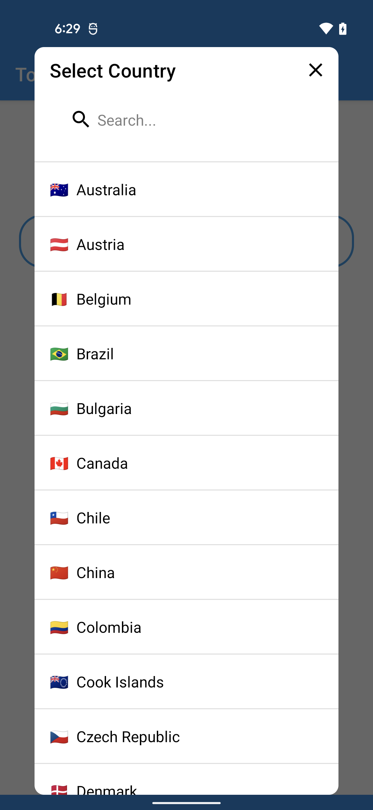
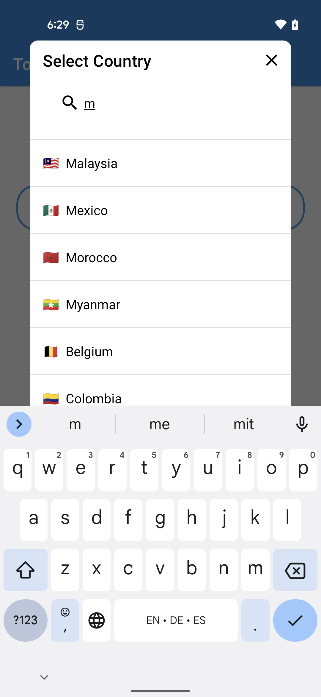

# Jetpack Compose Country Code Picker Emoji

[](https://github.com/jump-sdk/jetpack_compose_country_code_picker_emoji/actions/workflows/android.yml)
[](https://sonarcloud.io/summary/new_code?id=jump-sdk_jetpack_compose_country_code_picker_emoji)

* 😍 Emoji flag icons - beautiful and minimizes library size
* 🤔 Country numbers hints (option to disable)
* 🔢 Phone number visualTransformation (Automatic number formatting)
* 🇺🇳 Automatic country recognition (detection by sim card if sim card is inserted)
* ⚙️ Advanced customization options (see usage below)
* 🏁 Fast! Flattened layouts and immutable collections prevent unwanted recomposition.
* ✅ Code quality checks with Ktlint and Detekt, snapshot testing with Paparazzi
* 🗣 Multilingual:
    * Turkish
    * English
    * Italian
    * Arabic
    * Russian
    * Dutch
    * Spanish
    * Somali
    * French
    * Chinese

## Screenshots

<div class="row">
   
   
   
   
 </div>


## Usage


See [MainActivity in the sample app](https://github.com/jump-sdk/jetpack_compose_country_code_picker_emoji/blob/master/app/src/main/java/com/togitech/togii/MainActivity.kt) for a full example.

```kotlin 
        TogiCountryCodePicker(
            text = phoneNumber.value,
            onValueChange = { (code, phone), isValid ->
                Log.d("CCP", "onValueChange: $code $phone -> $isValid")
                phoneNumber.value = phone
                fullPhoneNumber.value = code + phone
                isNumberValid = isValid
            },
        )
```


| Parameter       | Description                                                                                                                                                                                            |
|-----------------|--------------------------------------------------------------------------------------------------------------------------------------------------------------------------------------------------------|
| text            | The text to be displayed in the text field.                                                                                                                                                            |
| onValueChange   | Called when the text in the text field changes. The first parameter is string pair of (country code, phone number) and the second parameter is a boolean indicating whether the phone number is valid. |
| modifier        | Modifier to be applied to the inner OutlinedTextField.                                                                                                                                                 |
| shape           | Shape of the text field.                                                                                                                                                                               |
| showCountryCode | Whether to show the country code in the text field.                                                                                                                                                    |
| showCountryFlag | Whether to show the country flag in the text field.                                                                                                                                                    |
| colors          | Colors to be used for the text field.                                                                                                                                                                  |
| fallbackCountry | The country to be used as a fallback if the user's country cannot be determined.                                                                                                                       |
| showPlaceholder | Whether to show the placeholder number in the text field.                                                                                                                                              |
| includeOnly     | A set of 2 digit country codes to be included in the list of countries. Set to null to include all supported countries.                                                                                |
| clearIcon       | The icon to be used for the clear button. Set to null to disable the clear button.                                                                                                                     |


## How to add in your project

Step 1: In the build.gradle add Jitpack repository.

In Groovy:

```groovy
    repositories {
        maven { url 'https://jitpack.io' }
    }

```

In Kts:

```kotlin
    repositories {
        maven("https://jitpack.io")
    }

```

Step 2. Add the dependency

```kotlin 
	dependencies {
	    implementation("com.github.jump-sdk:jetpack_compose_country_code_picker_emoji:2.0.1")
	}  
```

## Contributing

* [PRs](https://github.com/jump-sdk/jetpack_compose_country_code_picker_emoji/pulls) and [bug reports / feature requests](https://github.com/jump-sdk/jetpack_compose_country_code_picker_emoji/issues) are welcome!
* This project is linted with [ktlint](https://github.com/pinterest/ktlint) and statically checked with [detekt](https://github.com/detekt/detekt)
* Addtional checking done with [Twitter's](https://twitter.github.io/compose-rules/detekt/) and [appKODE's](https://github.com/appKODE/detekt-rules-compose) Jetpack Compose rules for Detekt
* Treat other people with helpfulness, gratitude, and consideration! See the [JetBrains CoC](https://confluence.jetbrains.com/display/ALL/JetBrains+Open+Source+and+Community+Code+of+Conduct)


## Based on [togisoft's Jetpack Compose Country Code Picker](https://github.com/togisoft/jetpack_compose_country_code_picker)

All support goes to the original author

<a href="https://www.buymeacoffee.com/togitech" target="_blank"></a>