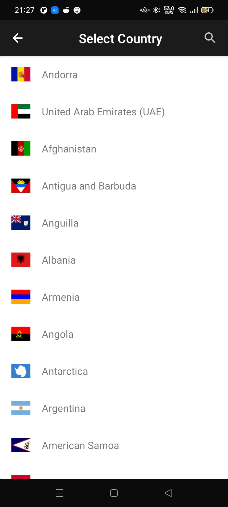
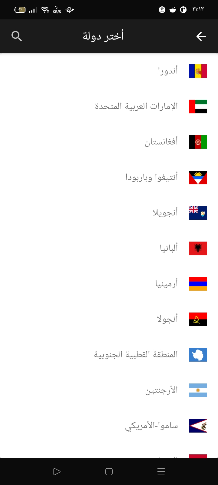
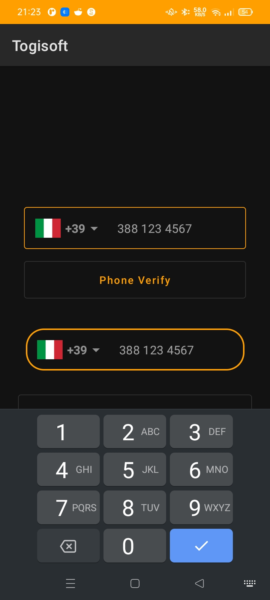
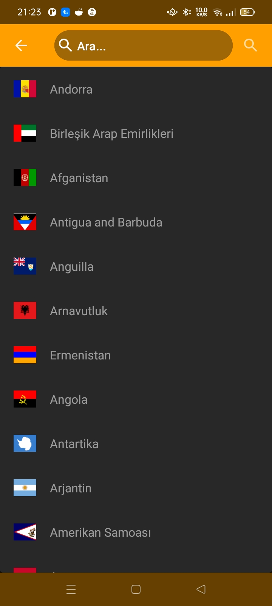

# Jetpack Compose Country Code Picker

Jetpack Compose Country Code Picker

<a href="https://www.buymeacoffee.com/togitech" target="_blank"></a>

If you are looking for Country Phone Code Picker for Jetpack Compose you can use the package.

* Country numbers hints
* Phone number visualTransformation (Automatic number formatting)
* Automatic country recognition (detection by sim card if sim card is inserted)
* With TextField
* Can Customize
* Adding language translations


Languages:

* Turkish
* English
* Italian
* Arabic

New features will be added every day. This project is open source without any profit motive.

For language support, you can translate the file below and send it to me.
https://github.com/togisoft/jetpack_compose_country_code_picker/blob/master/ccp/src/main/res/values/strings.xml

<h3>Screenshots</h3>
<div class="row">
   
   
   
   
   
   
   
   
   
 </div>


<h3> Rounded Field Usage </h3>

```kotlin
        val context = LocalContext.current
var phoneCode by rememberSaveable { mutableStateOf(getDefaultPhoneCode(context)) }
var defaultLang by rememberSaveable { mutableStateOf(getDefaultLangCode(context)) }
val phoneNumber = rememberSaveable { mutableStateOf("") }
var isValidPhone by remember { mutableStateOf(true) }

TogiRoundedPicker(
    value = phoneNumber.value,
    onValueChange = { phoneNumber.value = it },
    defaultCountry = getLibCountries().single { it.countryCode == defaultLang },
    pickedCountry = {
        phoneCode = it.countryPhoneCode
        defaultLang = it.countryCode
    },
    error = isValidPhone
)


```  

```kotlin
  // With Country Phone Code
@Composable
fun SelectCountryWithCountryCode() {
    val context = LocalContext.current
    var phoneCode by rememberSaveable { mutableStateOf(getDefaultPhoneCode(context)) }
    var defaultLang by rememberSaveable { mutableStateOf(getDefaultLangCode(context)) }
    val phoneNumber = rememberSaveable { mutableStateOf("") }
    var isValidPhone by remember { mutableStateOf(true) }
    var verifyText by remember { mutableStateOf("") }
    Column(
        modifier = Modifier.padding(16.dp)
    ) {
        Text(
            text = verifyText,
            fontWeight = FontWeight.Bold,
            modifier = Modifier
                .fillMaxWidth()
                .wrapContentSize(Alignment.Center)
        )
        TogiCountryCodePicker(
            pickedCountry = {
                phoneCode = it.countryPhoneCode
                defaultLang = it.countryCode
            },
            defaultCountry = getLibCountries().single { it.countryCode == defaultLang },
            focusedBorderColor = MaterialTheme.colors.primary,
            unfocusedBorderColor = MaterialTheme.colors.primary,
            dialogAppBarTextColor = Color.Black,
            dialogAppBarColor = Color.White,
            error = isValidPhone,
            text = phoneNumber.value,
            onValueChange = { phoneNumber.value = it }
        )

        val fullPhoneNumber = "$phoneCode${phoneNumber.value}"
        val checkPhoneNumber = checkPhoneNumber(
            phone = phoneNumber.value,
            fullPhoneNumber = fullPhoneNumber,
            countryCode = defaultLang
        )
        Button(
            onClick = {
                verifyText = if (checkPhoneNumber) {
                    isValidPhone = true
                    "Phone Number Correct"
                } else {
                    isValidPhone = false
                    "Phone Number is Wrong"

                }
            },
            modifier = Modifier.fillMaxWidth()
                .padding(16.dp)
                .height(60.dp)
        ) {
            Text(text = "Phone Verify")
        }
    }
}
```

<h3><- ********* Extras ********* -></h3>

* focusedBorderColor = TextField Border Color
* unfocusedBorderColor = TextField Unfocused Border Color
* cursorColor = TextField Cursor Color
* focusedBorderColorSearch = SearchField Border Color
* unfocusedBorderColorSearch = SearchField Unfocused Border Color
* cursorColorSearch = SearchFiled Cursor Color
* dialogAppBarColor = Dialog Top App Bar Background Color
* dialogAppBarTextColor = Dialog Top App Bar Text Color

<h3> How to add in your project </h3>

In the build.gradle add maven central repository

```groovy
    repositories {
    maven { url 'https://jitpack.io' }
}

```

Step 2. Add the dependency

```
  dependencies {
	    implementation 'com.github.togisoft:jetpack_compose_country_code_picker:1.1.3'

	}  
```    


