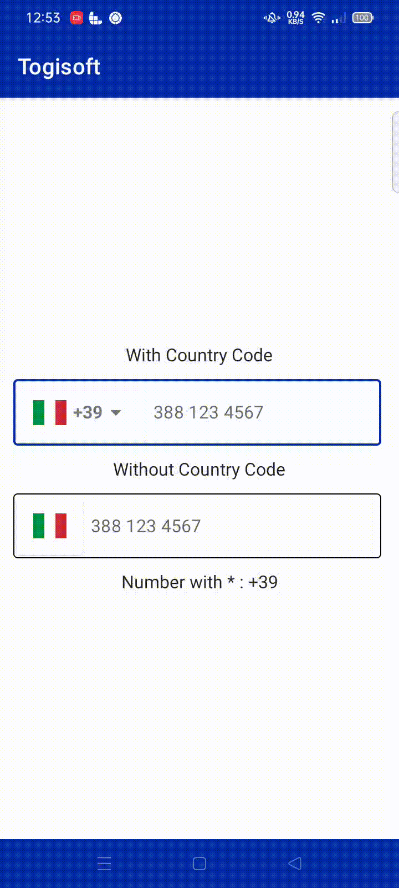
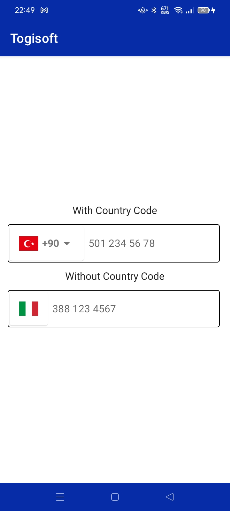
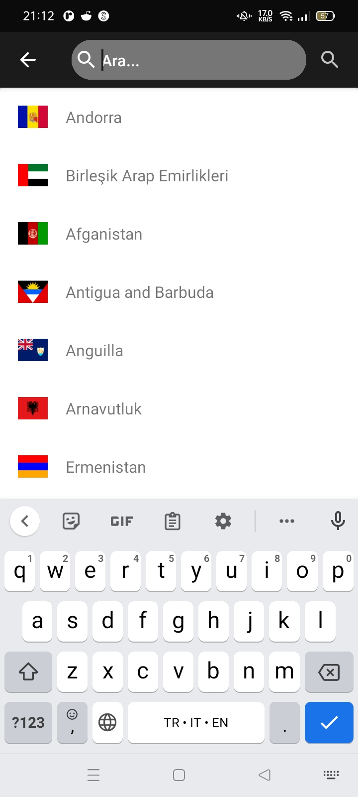
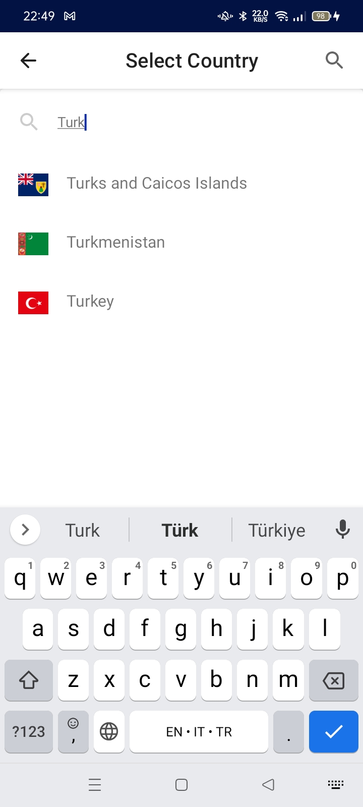

# Jetpack Compose Country Code Picker
Jetpack Compose Country Code Picker

<a href="https://www.buymeacoffee.com/togitech" target="_blank"></a>

If you are looking for Country Phone Code Picker for Jetpack Compose you can use the package.

* Country numbers hints
* Phone number visualTransformation (Automatic number formatting)
* Automatic country recognition (detection by sim card if sim card is inserted)
* With TextField
* Can Customize
* Adding language translations


<h3> <-******* Usage *******-> </h3>
  
  
```kotlin
  // With Country Phone Code
  @Composable
   fun SelectCountryWithCountryCode() {
        var selectedCountry by rememberSaveable { mutableStateOf(getDefaultCountryCode(this)) }
        val phoneNumber = rememberSaveable { mutableStateOf("") }
        var defaultCountry by rememberSaveable { mutableStateOf(getDefaultCountry(this))}

        TogiCountryCodePicker(
            pickedCountry = {
                selectedCountry = it.countryPhoneCode
                defaultCountry = it.countryCode

            },
            defaultCountry = getLibCountries().single { it.countryCode == defaultCountry },
            dialogAppBarTextColor = Color.Black,
            dialogAppBarColor = Color.White,
            text = phoneNumber.value,
            onValueChange = { phoneNumber.value = it }
        )

    }
```
  
  
```kotlin
  // Without Country Phone Code
  fun SelectCountryWithoutCountryCode() {
        var selectedCountry by rememberSaveable { mutableStateOf(getDefaultCountryCode(this)) }
        val phoneNumber = rememberSaveable { mutableStateOf("") }
        var defaultCountry by rememberSaveable { mutableStateOf(getDefaultCountry(this))}

        TogiCountryCodePicker(
            pickedCountry = {
                selectedCountry = it.countryPhoneCode
                defaultCountry = it.countryCode
            },
            defaultCountry = getLibCountries().single { it.countryCode == defaultCountry},
            showCountryCode = false,
            text = phoneNumber.value,
            onValueChange = { phoneNumber.value = it }
        )

        Text(text = "Number with * : $selectedCountry${phoneNumber.value}")
    }
```
  
  <h3><- ********* Extras ********* -></h3>
  
  * focusedBorderColor = TextField Border Color
  * unfocusedBorderColor = TextField Unfocused Border Color
  * cursorColor = TextField Cursor Color
  * focusedBorderColorSearch = SearchField Border Color
  * unfocusedBorderColorSearch = SearchField Unfocused Border Color
  * cursorColorSearch = SearchFiled Cursor Color
  * dialogAppBarColor = Dialog Top App Bar Background Color
  * dialogAppBarTextColor = Dialog Top App Bar Text Color

  
<h3> How to add in your project </h3>
 
In the build.gradle add maven central repository
    
    
    
```groovy
    repositories {
maven { url 'https://jitpack.io' }
}
    
```
Step 2. Add the dependency
```
  dependencies {
	        implementation 'com.github.togisoft:jetpack_compose_country_code_picker:5a3b7b0aba'
	}  
```    
    
    
    
<br>
<div class="row">
     
   
   
   
   
 </div>
